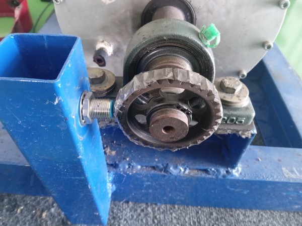
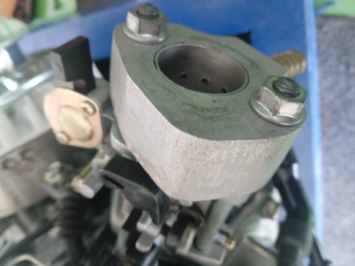

# PNM Engine Control Planning

Custom Engine Control Unit for LPG

## Planning

- [X] Ngobrol Rencana

### Input

- [ ] Crankshaft Position Sensor
    - [ ] Pasang Gigi. Rencana Penempatan 12-1 Crank Tooth:

    - [ ] Cetak Akrilik Crank Teeth 12-1
    - [ ] Pasang Sensor Gigi. Rencana Sensor: Opto Interruptor: [Tokopedia](https://www.tokopedia.com/xurve-store/fc-03-ir-infrared-speed-kecepatan-sensor-photo-opto-interruptor)

- [ ] Trottle Position Sensor
    - [ ] Pemasangan. Dimana dekat mesin karena tidak terkoneksi dengan mekanik intake
    - [ ] Pembelian Sensor TPS: [Tokopedia](https://www.tokopedia.com/primacave/terbaru-sensor-tps-throttle-position-sensor-beat-fi-vario-125-thalland)

- [ ] Optimasi
    - [ ] Sensor Temperature (Tentative)
    - [ ] CO2 Sensor. Rencana [Tokopedia](https://www.tokopedia.com/amanahotopart/sensor-oxygen-honda-jazz-city-belakang-oksigen-co2-o2-copotan-asli-ori)
    
### Output

- [ ] Intake
    - [ ] Injector. Rencana [Tokopedia](https://www.tokopedia.com/sumahonda/injector-assy-fuel-pcx-150-k97-vario-150-esp-16450k59a11)
    - [ ] Pemasangan depan Inlet tanpa klep pengatur udara:

