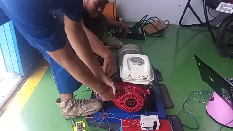
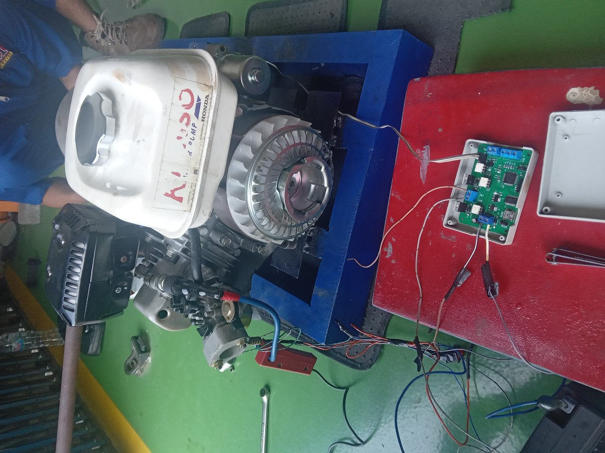
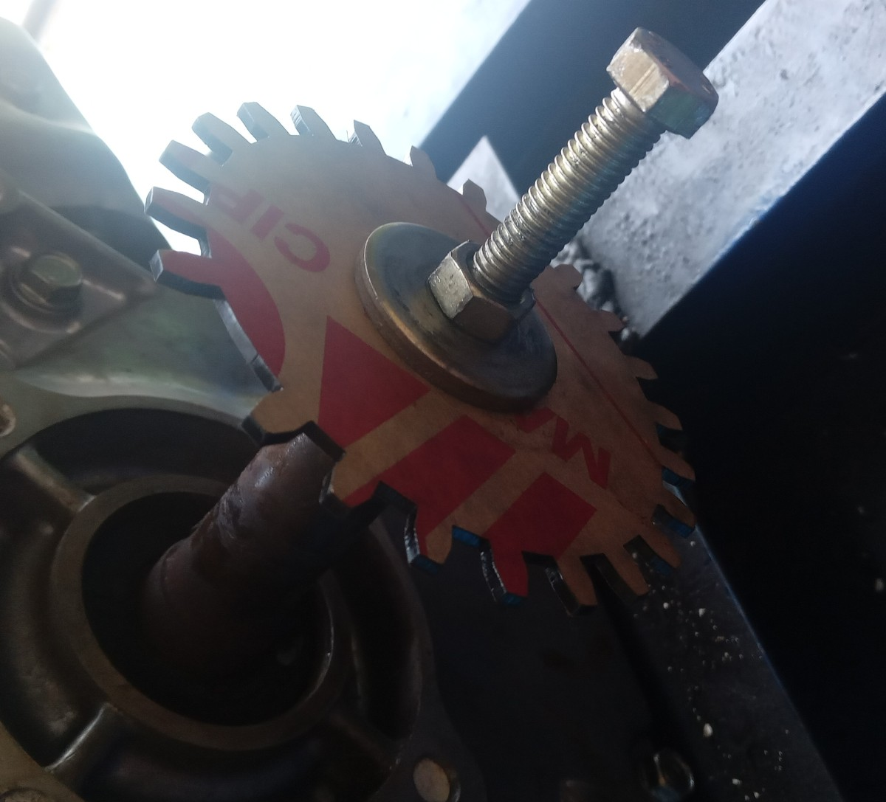

# Catatan Kegiatan 19 September 2023

## Progress Kegiatan

### Hasil

Beberapa hasil yg didapat:
- Mesin sempat idle dalam waktu singkat namun tidak lanjut
- Timing pembakaran stabil namun terkadang masih terlambat
- Tidak ada gejala knocking

Klik gambar ini untuk memulai video

Perbaikan jaringan elektrikal dan koil ditukar.

[]

### Catatan Perbaikan
- Pindah Crank-Teeth ke dekat block mesin untuk pembacaan lebih stabil

[]

- Update PCB sesuai catatan [berikut](https://github.com/deninur2427/ecu_pnm/blob/main/docs/notes/tes_24082023.md#update-pcb) dan mengecilkan ukuran