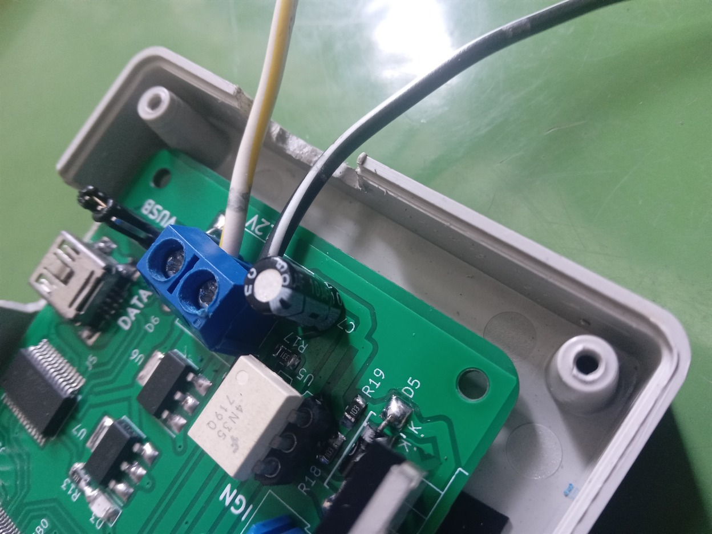

# Catatan Kegiatan 24 Agustus 2023

## Progress Kegiatan

### Perakitan

Merapikan wiring dan posisi coil

Kemudian instal prototipe ECU baru

### Kendala

#### Coil Unstable

Coil memercik terus menerus.
Menyebabkan chip FTDI mati.

Dikurangi menggunakan Elco 10uF/25V

#### Engine Unstarted

Engine masih knocking

## Improvisasi

### Metode Tes

Pakai Ignition Timing Light Test

### Update PCB
- Regulator 5v ditambah opsi ke 7805
- Serial-TTL ganti CH340C
- Wajib ada Capacitor Decouple dan Stabilizer
    + 100uF di 12V
    + 0.1uF/100nF di 3v3 untuk Serial-TTL dan STM32