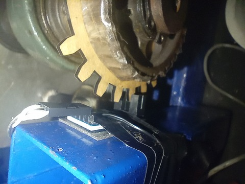
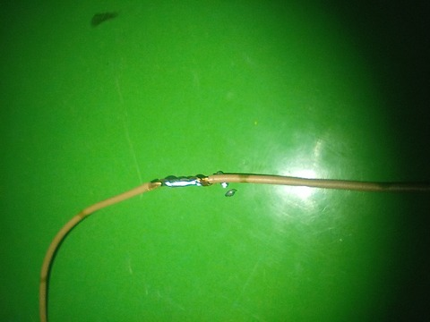
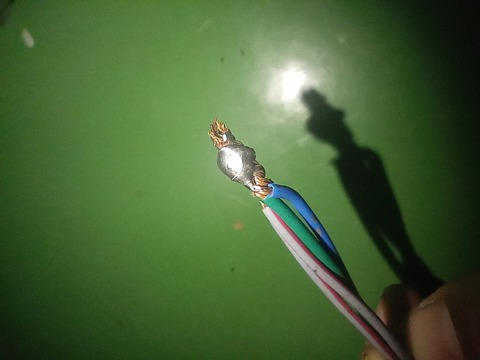
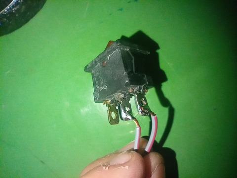
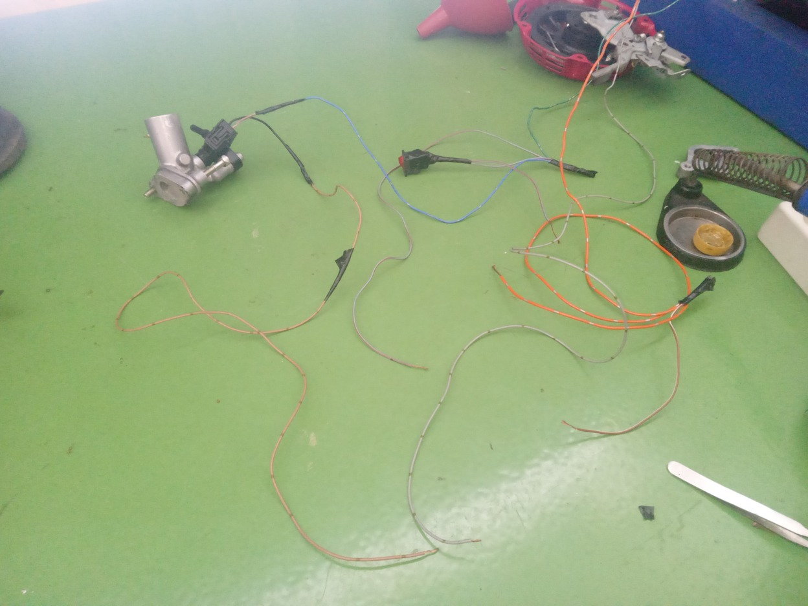
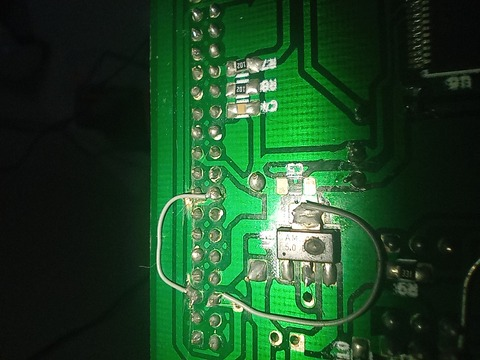
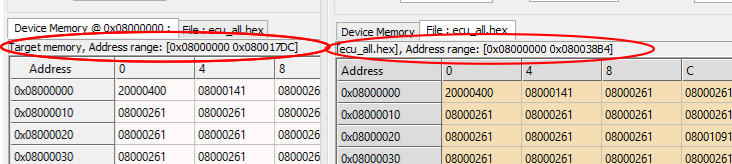
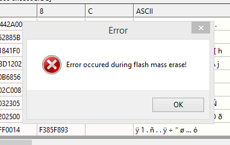
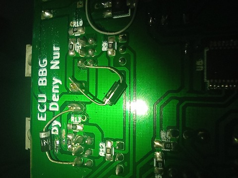

# Catatan Kegiatan 31 Juli 2023

## Progress Kegiatan

### Perakitan:

#### Encoder

PickUp encoder untuk posisi Crankshaft telah terpasang.

**Catatan:** Perhitungan nomor gigi perlu dicek ulang

#### Wiring Coil

Konfigurasi Wiring:
- 0V di tulang coil
- Signal di pin dekat kabel busi
- 12V di pin yang tersisa
    
**Catatan:** Coil sudah dapat memantik
    
#### Wiring Injector

Konfigurasi Wiring:
- 12V di kabel merah
- Signal di kabel hitam
    
#### Wiring Overall

Dokumentasi hasil Wiring dan pemasangan Sakelar:

### Masalah

Tegangan Induksi Balik dari Coil menyebabkan:

- Regulator 3.3 Volt terbakar:

- Chip STM32 mengalami kerusakan di internal flash memory sehingga ukuran memory mengecil dan tidak dapat "mass erase":

### Penanganan Masalah

- Pemasangan Diode Proteksi Induksi

- Ganti Chip STM32